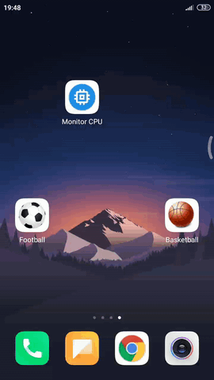
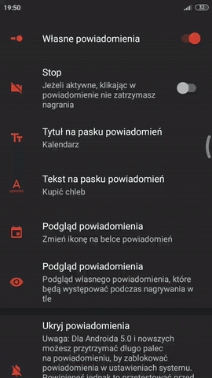

# Założenia
## Aplikacja nagrywa wideo(z dźwiękiem) lub dźwięk nawet po:
- wyjściu z aplikacji
- zablokowaniu urządzenia

## Rozpoczęcie nagrywania -wideo(z dźwiękiem) lub -dźwięku poprzez:
- wejście w główną aplikację i kliknięcie w przycisk nagrywaj
- ~~pomocnicze aplikacje:~~
	* ~~np. ikona z piłką: rozpoczyna nagrywanie video (kamera tylna) z dźwiękiem (i kolejne kliknięcie kończy)~~
	*  ~~np. ikona z pomidorem: rozpoczyna nagrywanie dźwięku i kończy~~
	* ~~rozpoczyna nagrywanie video (kamera frontowa) z dźwiękiem i kończy~~

## Zakończenie nagrywania
- kliknięcie w głównej aplikacji (tam gdzie jest stoper) przycisku stop
- kliknięcie w powiadomienie
- ~~kliknięcie drugi raz w aplikację skrót~~

## Działanie
Jedyną informacją o nagrywaniu jest customowe powiadomienie, w rozwijanej liście powiadomień, nie może być żadnego, dźwięku itp. Jedyne co może być to wibracja po rozpoczęciu i zakończeniu nagrywania(będzie można to zmienić w ustawieniach aplikacji)

## W ustawieniach:
- Wibruj po rozpoczęciu nagrywania tak/nie
- Wibruj po zakończeniu nagrywania tak/nie
- ~~Folder zapisu nagrań~~ (zrezygnowaliśmy z powodu ograniczeń flutter'a
- Ustawienie powiadomienia(własne ustawienia powiadomień nagrywania) - ustawienie jaki tytuł, tekst, jaka ikona
- ~~Ustawienia skrótów aplikacji(jaką mają mieć ikonę)~~

